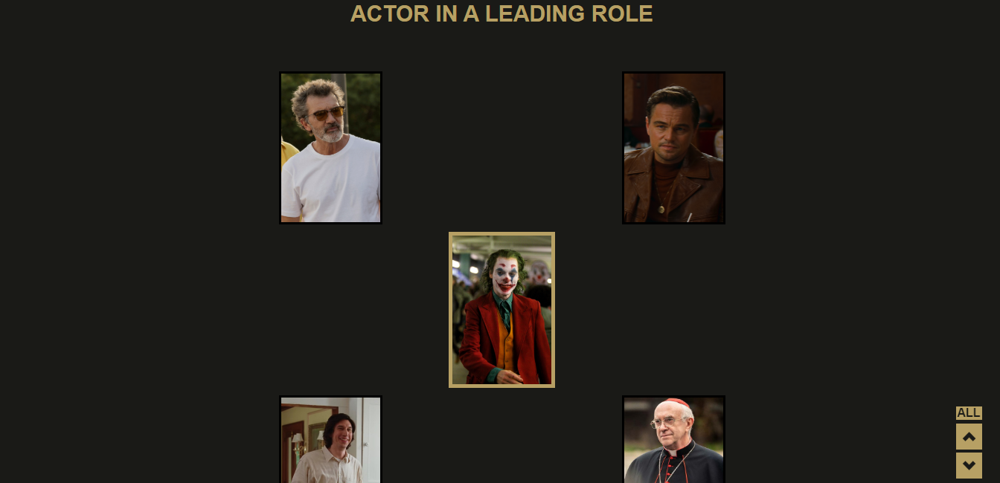

# Oscar

**Version 1.0.0**

Simple website with purpose to traine flexbox and HTML
- This website is responsive
---

## Images

---
## Contributors

- Raphael S. G. de Andrade <raphaelsatomiandrade@gmail.com>

